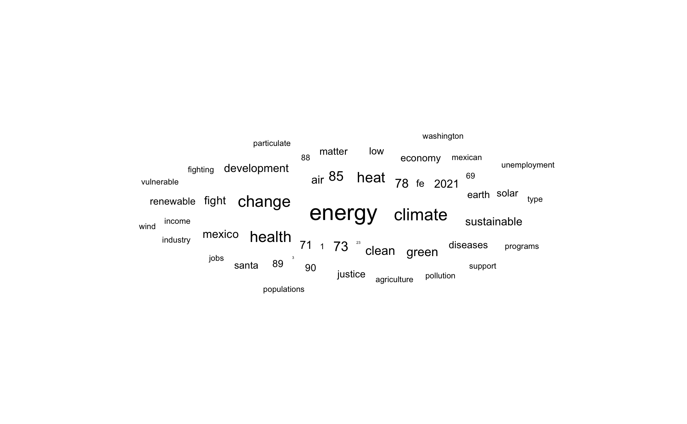

```{r, include=FALSE}
library(tidyverse)
library(tidytext)
library(ggwordcloud)
library(readr)
library(gutenbergr)
library(textdata)
```


### Pacific Region
```{r, echo=FALSE, warning=FALSE, message=FALSE}
tfidfpacific <- read_csv("tfidfpacific.csv")
(tfidfpacific)
```

#### LA Times


#### Alaska Dispatch News


#### The Spokesman-Review


### Rocky Mountain Region
```{r, echo=FALSE, warning=FALSE, message=FALSE}
tfidfmtn <- read_csv("tfidfmtn.csv")
(tfidfmtn)
```

#### Idaho Falls Post Register


#### The Salt Lake Tribune


#### The Wyoming Tribune


### Midwest Region
```{r, echo=FALSE, warning=FALSE, message=FALSE}
midwest_tfidf <- read_csv("Midwest_Wordcloud_tfidf/midwest_tfidf.csv")
(midwest_tfidf)
```

#### Illinois


#### Indiana


#### Iowa


#### Kansas


#### Michigan 


#### Minnesota


#### Missouri


#### North Daktoa


#### Nebraska


#### Ohio


#### South Dakota


##### Wisconsin


### Southwest Region
```{r, echo=FALSE, warning=FALSE, message=FALSE}
southwest_tfidf <- read_csv("Southwest_wordclouds_tfidf/southwest_tfidf.csv")
(southwest_tfidf)
```

#### Arizona


#### New Mexico





#### Oklahoma


#### Texas


### Northeast Region
```{r, echo=FALSE, warning=FALSE, message=FALSE}
tfidf_northeast <- read_csv("tfidf_northeast.csv")
(tfidf_northeast)
```

#### Northeast Wordclouds


### Southeast Region
```{r, echo=FALSE, warning=FALSE, message=FALSE}
tfidf_southeast <- read_csv("tfidf_southeast.csv")
(tfidf_southeast)
```

#### Southeast Wordclouds


### Final Analysis
  We found that almost all of the articles we chose had more negative words than positive when comparing the BING sentiment values. This is unsurprising, but where we see differences in region is the words that cause these negative values. For example, the word “misinformation” appeared with high frequency in the south region, compared to words like “emission” or “damage” from other regions across the country. We think this is an interesting difference between what different regions in the US might think the problem with climate change is. The south region had articles which seemed to think the problem is overreaction, misinformation, and government control. The pacific region had articles very fearful of the effects of climate change, as did the midwest region with “floods” and other extreme weather being high frequency words. The Rocky Mountain region was the only region with an even distribution of negative and positive valued words. However we did not think this was too surprising, given the political affiliation of states the newspapers were pulled from - Utah, Wyoming, and Idaho.


  There was also an interesting difference between regions in terms of the scale of climate change. For example, articles pulled from the south region had words like “Americans” and “national”, where the articles from the northeast region had words such as “world”, “countries”, and “global”. High frequency words from the midwest and pacific regions also mentioned words of government and politics, but nothing specifically global. We thought it was interesting that only one  article clearly conveyed a concern for the rest of the world, when climate change has been established as a global issue. 


  Another interesting difference between regions we found was whether regions had a stronger correlation with problems or solutions. Articles pulled from the southwest region had high frequency words like “energy” and “oil” and “emissions”, compared to “education” and “change” from the midwest articles. This seems to convey the idea that the midwest was more concerned for solutions to the existing effects of climate change, whereas the south region could be more focused on identifying the roots of the problem.
  

  Overall, we think we have a general sense of feelings towards climate change over the different regions of the US. However, for future research, we think it would be a good idea to collect articles from every state, and not only use articles that came from big newspapers. We think we might see more of people’s true opinions on climate change if we do not primarily focus on articles coming from bigger cities. 
